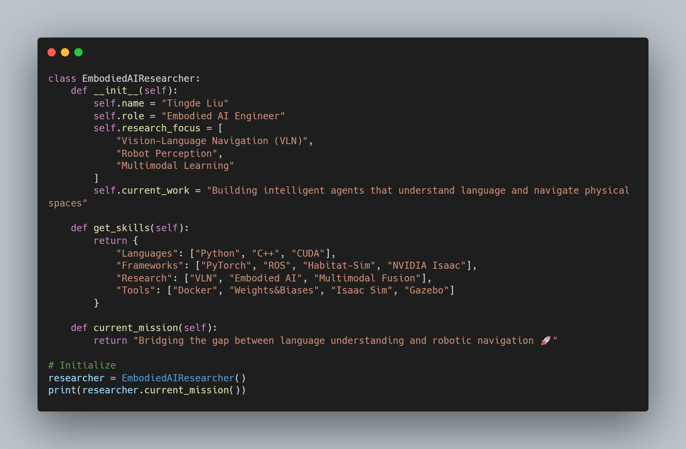

<div align="center">

```
████████╗██╗   ██╗███╗   ██╗██████╗  █████╗ ██╗     ██╗            ██╗      █████╗ ██████╗ ███████╗
╚══██╔══╝╚██╗ ██╔╝████╗  ██║██╔══██╗██╔══██╗██║     ██║            ██║     ██╔══██╗██╔══██╗██╔════╝
   ██║    ╚████╔╝ ██╔██╗ ██║██║  ██║███████║██║     ██║            ██║     ███████║██████╔╝███████╗
   ██║     ╚██╔╝  ██║╚██╗██║██║  ██║██╔══██║██║     ██║            ██║     ██╔══██║██╔══██╗╚════██║
   ██║      ██║   ██║ ╚████║██████╔╝██║  ██║███████╗███████╗       ███████╗██║  ██║██████╔╝███████║
   ╚═╝      ╚═╝   ╚═╝  ╚═══╝╚═════╝ ╚═╝  ╚═╝╚══════╝╚══════╝       ╚══════╝╚═╝  ╚═╝╚═════╝ ╚══════╝

```

---

## 🧠 About Me

```html
<p align="center">
  
</p>
```
---

## 🔬 Research Interests

<table>
<tr>
<td width="33%">

### 🤖 Embodied AI
- Vision-Language Navigation (VLN)
- Vision-Language Action (VLA)
- World Models
- Diffusion Policy

</td>
<td width="33%">

### 🧭 Robot Navigation
- Semantic SLAM
- Object-Goal Navigation
- Sim-to-Real Transfer
- End-to-End Learning for Navigation

</td>
<td width="33%">

### 🎯 Agentic AI
- Autonomous AI Agents
- Multi-Agent Systems
- Tool-Using AI
- Reasoning & Planning

</td>
</tr>
</table>

---

## 📊 GitHub Stats

<p align="center">
  <a href="https://github.com/TingdeLiu">
    
  </a>
  <a href="https://github.com/TingdeLiu">
    
  </a>
</p>


---

## 🐍 Contribution Snake - Eating My Commits!

<div align="center">
  
<picture>
  <source media="(prefers-color-scheme: dark)" srcset="https://raw.githubusercontent.com/TingdeLiu/TingdeLiu/output/github-snake-dark.svg" />
  <source media="(prefers-color-scheme: light)" srcset="https://raw.githubusercontent.com/TingdeLiu/TingdeLiu/output/github-snake.svg" />
  
</picture>

</div>

---

## 🛠️ Tech Stack

<div align="center">


</div>

---


<div align="center">
  


</div>
