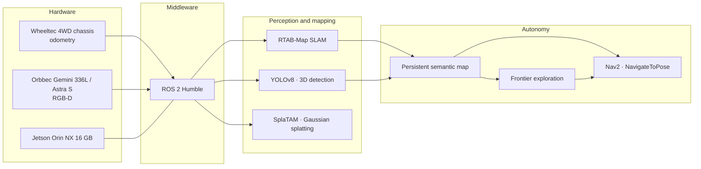

<h1 align="center">Tingde Liu</h1>

  Embodied AI engineer · semantic navigation, SLAM and vision-language navigation 
  M.Sc. Robotics, Leibniz Universität Hannover

  <a href="https://tingdeliu.github.io/">Blog</a> ·
  <a href="https://tingdeliu.github.io/VLN-Survey/">VLN Survey</a> ·
  <a href="mailto:tingde.liu.luh@gmail.com">Email</a>

I build navigation systems that run on real robots, and I write down what works and what does not. My work sits between classical robotics (SLAM, Nav2, frontier exploration) and learned policies (VLN, VLA), with ROS 2 as the glue.

---

## Selected work

<table>
<tr>
<td width="50%" valign="top">

### [Semantic-Nav](https://github.com/TingdeLiu/Semantic-Nav)
**Object-goal navigation on a real robot (ROS 2).**
YOLOv8 3D detections and RTAB-Map SLAM become a persistent, queryable semantic map. Ask for a category and the robot navigates there through Nav2. If the object is not on the map yet, it explores frontiers until it finds one.

`ROS 2 Humble` `RTAB-Map` `Nav2` `YOLOv8` `Wheeltec` `Orbbec Gemini 336L`

</td>
<td width="50%" valign="top">

### [rrt_exploration](https://github.com/TingdeLiu/rrt_exploration)
**Autonomous exploration: RRT vs hybrid frontier detection (HFD / RRT+).**
Gazebo + ROS 2 platform with A* and B-spline global planning and DWA local control. Dockerized, with noVNC access. HFD / RRT+ explored faster than RRT on all four recorded maps (4.6–12.6 % less time), at the cost of slightly longer paths. Single runs per map, so these are demonstrations, not a benchmark.

`ROS 2 Humble` `Gazebo` `A*` `DWA` `Docker`

</td>
</tr>
</table>

| Project | Question | Outcome |
| --- | --- | --- |
| [TurboVLN](https://github.com/TingdeLiu/TurboVLN) | Does the TurboVLA recipe (GroundingDINO bidirectional fusion, DINOv3, ACT chunk decoding) transfer from manipulation to R2R-CE? | **No-Go**, fully documented. Three grounding pilots reached 9.42–14.13 % exact patch accuracy against a 60 % gate. 202 CPU tests, geometry pinned against InternNav. |
| [SplaTAM (fork)](https://github.com/TingdeLiu/SplaTAM) | Can SplaTAM run on real sensors rather than benchmark sequences? | Deployment guides and scripts for Orbbec Astra S, Orbbec Gemini 336L and iPhone LiDAR. Online and offline SLAM, ROS 2 bag conversion, CloudCompare PLY export. Runs on a Wheeltec robot with a Jetson Orin NX. |
| [tls-uncertainty-modeling](https://github.com/TingdeLiu/tls-uncertainty-modeling) | Can a network predict point-wise range residuals of a terrestrial laser scanner? | RePN, a multi-scale PointNet-style regressor, on 2.53 M Z+F IMAGER 5016 measurements. In the original study, mean residual 0.387 mm → 0.009 mm after calibration. Study data is not released. |

---

## Robot stack

The platform behind the navigation and mapping projects, as documented in the repositories:

```mermaid
flowchart LR
    subgraph HW["Hardware"]
        Base["Wheeltec 4WD chassis<br/>odometry"]
        Cam["Orbbec Gemini 336L / Astra S<br/>RGB-D"]
        Compute["Jetson Orin NX 16 GB"]
    end
    subgraph MW["Middleware"]
        ROS["ROS 2 Humble"]
    end
    subgraph Perception["Perception and mapping"]
        RTAB["RTAB-Map SLAM"]
        YOLO["YOLOv8 · 3D detection"]
        Splat["SplaTAM · Gaussian splatting"]
    end
    subgraph Autonomy["Autonomy"]
        Sem["Persistent semantic map"]
        Nav["Nav2 · NavigateToPose"]
        Explore["Frontier exploration"]
    end
    Base --> ROS
    Cam --> ROS
    Compute --- ROS
    ROS --> RTAB --> Sem
    ROS --> YOLO --> Sem
    ROS --> Splat
    Sem --> Nav
    Sem --> Explore --> Nav
```

---

## Writing

Long-form survey and reading notes on [my blog](https://tingdeliu.github.io/), kept up to date as the field moves.

| Topic | Posts |
| --- | --- |
| Vision-language navigation | [VLN Survey](https://tingdeliu.github.io/VLN-Survey/) · [Papers: instruction following](https://tingdeliu.github.io/VLN-Papers/) · [Papers: object-goal and extended](https://tingdeliu.github.io/VLN-Papers-Extended/) |
| Embodied agents | [Embodied Agent Harness Survey](https://tingdeliu.github.io/Embodied-Agent-Harness-Survey/) · [Embodied Agent Papers](https://tingdeliu.github.io/Embodied-Agent-Papers/) |
| Models and perception | [VLA](https://tingdeliu.github.io/VLA-Survey/) · [VLM](https://tingdeliu.github.io/VLM-Survey/) · [World Models](https://tingdeliu.github.io/World-Models-Survey/) · [Spatial Intelligence](https://tingdeliu.github.io/Spatial-Intelligence-Survey/) |
| Robotics fundamentals | [Robot Navigation](https://tingdeliu.github.io/Robot-Navigation-Survey/) · [ROS 2 architecture](https://tingdeliu.github.io/ROS2-Survey/) · [Reinforcement Learning](https://tingdeliu.github.io/Reinforcement-Learning-Survey/) |
| Weekly digest | Embodied-navigation weekly, for example [2026-09-27](https://tingdeliu.github.io/vln-weekly-2026-09-27/) |

---

## Toolbox

| Area | Tools |
| --- | --- |
| Robotics | ROS 2, Nav2, RTAB-Map, Gazebo, NVIDIA Isaac Sim, Habitat-Sim |
| Learning | PyTorch, CUDA, Weights & Biases, DINOv3, GroundingDINO |
| Languages | Python, C++ |
| Engineering | Docker, uv, pytest, GitHub Actions, Ubuntu |

---

## Open to

Discussion and collaboration on VLN, semantic navigation, sim-to-real transfer and embodied-agent runtimes. The fastest way to reach me is [email](mailto:tingde.liu.luh@gmail.com).
